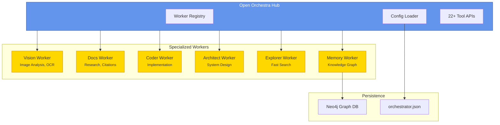
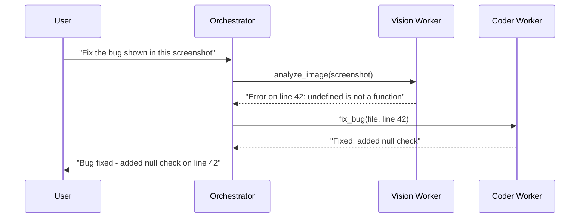
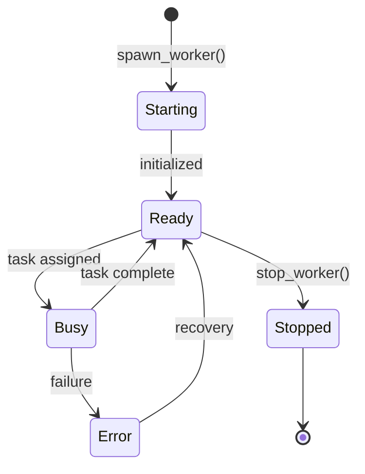
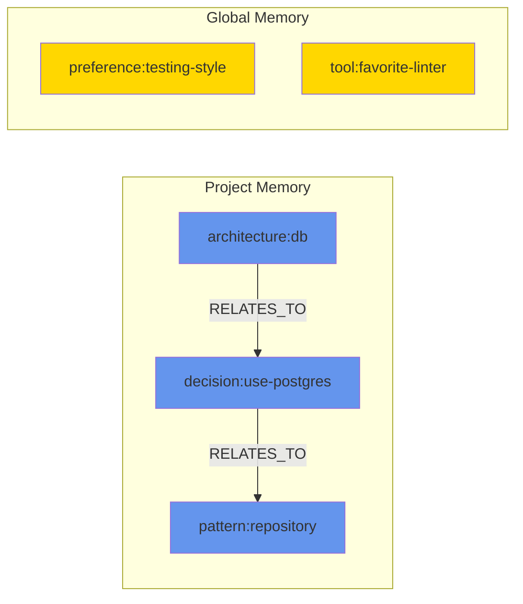

<p align="center">
  <svg xmlns="http://www.w3.org/2000/svg" viewBox="0 0 400 120" width="400" height="120">
    <defs>
      <linearGradient id="grad1" x1="0%" y1="0%" x2="100%" y2="100%">
        <stop offset="0%" style="stop-color:#6495ED;stop-opacity:1" />
        <stop offset="100%" style="stop-color:#4169E1;stop-opacity:1" />
      </linearGradient>
      <linearGradient id="grad2" x1="0%" y1="0%" x2="100%" y2="0%">
        <stop offset="0%" style="stop-color:#FFD700;stop-opacity:1" />
        <stop offset="100%" style="stop-color:#FFA500;stop-opacity:1" />
      </linearGradient>
    </defs>
    <!-- Central Hub -->
    <circle cx="60" cy="60" r="35" fill="url(#grad1)" stroke="#2F4F8F" stroke-width="2"/>
    <text x="60" y="65" text-anchor="middle" fill="white" font-size="12" font-weight="bold" font-family="system-ui">HUB</text>
    <!-- Spokes -->
    <line x1="95" y1="60" x2="130" y2="30" stroke="#4169E1" stroke-width="2" stroke-dasharray="4"/>
    <line x1="95" y1="60" x2="130" y2="60" stroke="#4169E1" stroke-width="2" stroke-dasharray="4"/>
    <line x1="95" y1="60" x2="130" y2="90" stroke="#4169E1" stroke-width="2" stroke-dasharray="4"/>
    <!-- Worker Nodes -->
    <circle cx="145" cy="30" r="15" fill="url(#grad2)" stroke="#CC8400" stroke-width="1.5"/>
    <circle cx="145" cy="60" r="15" fill="url(#grad2)" stroke="#CC8400" stroke-width="1.5"/>
    <circle cx="145" cy="90" r="15" fill="url(#grad2)" stroke="#CC8400" stroke-width="1.5"/>
    <!-- Title -->
    <text x="185" y="50" fill="#333" font-size="28" font-weight="bold" font-family="system-ui">Open</text>
    <text x="260" y="50" fill="#6495ED" font-size="28" font-weight="bold" font-family="system-ui">Orchestra</text>
    <text x="185" y="75" fill="#666" font-size="14" font-family="system-ui">Multi-Agent Orchestration for OpenCode</text>
  </svg>
</p>

<p align="center">
  <a href="https://github.com/0xSero/open-orchestra/releases"></a>
  <a href="https://github.com/0xSero/open-orchestra/blob/main/LICENSE"></a>
  <a href="https://bun.sh"></a>
  <a href="https://opencode.ai"></a>
</p>

<p align="center">
  <strong>Spawn, manage, and coordinate specialized AI workers in OpenCode</strong>
</p>

---

## Overview

**Open Orchestra** is a multi-agent orchestration plugin for [OpenCode](https://opencode.ai) that enables you to spawn, manage, and coordinate specialized AI workers. It implements a **hub-and-spoke architecture** where a central orchestrator coordinates multiple specialized workers, each optimized for specific tasks.

### Key Features

- **6 Built-in Worker Profiles** - Vision, Docs, Coder, Architect, Explorer, Memory
- **Hub-and-Spoke Architecture** - Central orchestrator with specialized workers
- **Neo4j-Backed Memory System** - Persistent knowledge graph for project/global context
- **Profile-Based Spawning** - Auto-model resolution from OpenCode config
- **22+ Tool APIs** - Comprehensive tooling for worker management and delegation
- **DCP-Inspired Context Pruning** - Automatic context management for long sessions
- **Dynamic Port Allocation** - Avoids conflicts with automatic port assignment
- **Session-Based Isolation** - Each worker maintains its own conversation context

## Architecture

Open Orchestra follows a hub-and-spoke pattern inspired by successful multi-agent systems like AutoGen and LangGraph, but optimized for OpenCode's plugin architecture.



## Quick Start

### Installation

```bash
# Add to your project
bun add opencode-orchestrator

# Or install globally
bun add -g opencode-orchestrator
```

### Configuration

**1. Add the plugin to OpenCode:**

```json
// opencode.json or ~/.config/opencode/opencode.json
{
  "plugin": ["opencode-orchestrator"]
}
```

**2. Create orchestrator config (optional - auto-setup available):**

```json
// .opencode/orchestrator.json or orchestrator.json
{
  "$schema": "./node_modules/opencode-orchestrator/schema/orchestrator.schema.json",
  "autoSpawn": true,
  "workers": ["vision", "docs", "coder"]
}
```

**3. Auto-configure models:**

Run inside OpenCode:
```
orchestrator.setup
```

This auto-populates profile models from your current OpenCode model configuration.

### Basic Usage



**Spawn workers:**
```bash
spawn_worker({ profileId: "vision" })
spawn_worker({ profileId: "docs" })
```

**Delegate tasks:**
```bash
delegate_task({ task: "Analyze this screenshot", requiresVision: true })
delegate_task({ task: "Find the official React hooks documentation" })
```

**Direct messaging:**
```bash
ask_worker({ workerId: "vision", message: "What's in this image?", attachments: [...] })
```

## Built-in Profiles

| Profile | Model Tag | Vision | Web | Purpose |
|---------|-----------|--------|-----|---------|
| `vision` | `auto:vision` | Yes | No | Image analysis, OCR, UI review |
| `docs` | `auto:docs` | No | Yes | Documentation research, examples, citations |
| `coder` | `auto` | No | No | Code implementation, file operations |
| `architect` | `auto` | No | No | System design, planning (read-only) |
| `explorer` | `auto:fast` | No | No | Fast codebase searches |
| `memory` | `auto` | No | Yes | Neo4j memory graph, context pruning |

## Worker Lifecycle



## Documentation

- [Architecture Deep Dive](./docs/architecture.md) - System design and patterns
- [API Reference](./docs/api-reference.md) - Complete tool documentation
- [Configuration Guide](./docs/configuration.md) - Profiles and settings
- [Examples](./docs/examples.md) - Common workflows and use cases
- [Memory System](./docs/memory.md) - Neo4j-backed knowledge management
- [CHANGELOG](./CHANGELOG.md) - Version history and changes

## Tool Categories

### Worker Management
- `spawn_worker` - Start a new worker
- `stop_worker` - Stop a running worker
- `ensure_workers` - Ensure workers are running
- `list_workers` - List active workers
- `get_worker_info` - Detailed worker info

### Task Delegation
- `delegate_task` - Auto-route to best worker
- `ask_worker` - Direct worker messaging
- `find_worker` - Find suitable worker

### Configuration
- `list_models` - Available OpenCode models
- `list_profiles` - Available worker profiles
- `set_profile_model` - Map profile to model
- `set_autospawn` - Configure auto-spawn
- `autofill_profile_models` - Auto-configure models
- `orchestrator_config` - Show effective config

### Memory (Neo4j)
- `memory_put` - Store memory entry
- `memory_link` - Create relationships
- `memory_search` - Search memory graph
- `memory_recent` - Recent entries

## Memory System

Open Orchestra includes a Neo4j-backed memory system for persistent knowledge storage:



**Setup:**
```bash
export OPENCODE_NEO4J_URI=bolt://localhost:7687
export OPENCODE_NEO4J_USERNAME=neo4j
export OPENCODE_NEO4J_PASSWORD=your-password
```

**Usage:**
```bash
memory_put({ key: "architecture:db", value: "Using PostgreSQL with Drizzle ORM", tags: ["database"] })
memory_search({ query: "database" })
```

## Development

```bash
# Install dependencies
bun install

# Type check
bun run typecheck

# Build
bun run build

# Run tests
bun test
```

## Project Structure

```
opencode-orchestrator/
├── src/
│   ├── index.ts              # Plugin entry point
│   ├── config/
│   │   ├── orchestrator.ts   # Config loading/merging
│   │   └── profiles.ts       # Built-in worker profiles
│   ├── core/
│   │   └── registry.ts       # Worker registry
│   ├── memory/
│   │   ├── graph.ts          # Memory graph operations
│   │   └── neo4j.ts          # Neo4j connection
│   ├── models/
│   │   ├── catalog.ts        # Model catalog utilities
│   │   └── hydrate.ts        # Model resolution
│   ├── tools/
│   │   └── index.ts          # 22+ tool implementations
│   ├── types/
│   │   └── index.ts          # TypeScript definitions
│   ├── ux/
│   │   ├── idle-notification.ts
│   │   └── pruning.ts        # Context pruning
│   └── workers/
│       ├── prompt.ts         # Prompt building
│       └── spawner.ts        # Worker lifecycle
├── schema/
│   └── orchestrator.schema.json
├── examples/
│   ├── orchestrator.json
│   ├── orchestrator-custom.json
│   └── opencode-with-orchestrator.json
├── docs/
│   ├── architecture.md
│   ├── api-reference.md
│   ├── configuration.md
│   ├── examples.md
│   └── memory.md
└── test/
    ├── e2e.test.ts
    └── orchestrator.test.ts
```

## Contributing

Contributions are welcome! Please read our contributing guidelines and submit PRs to the `main` branch.

## License

MIT - see [LICENSE](./LICENSE) for details.

---

<p align="center">
  Built for <a href="https://opencode.ai">OpenCode</a> with orchestration patterns inspired by multi-agent systems research.
</p>