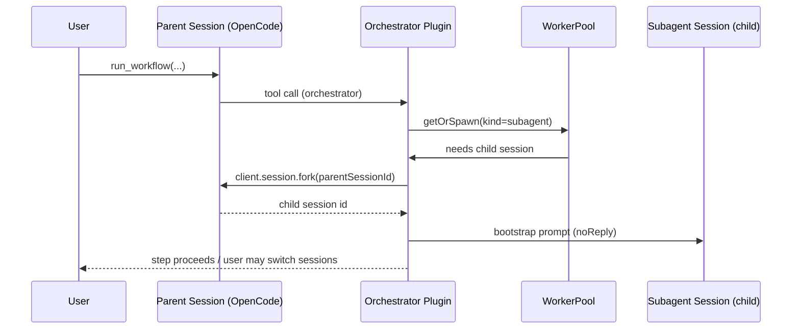

# Task 02 — Subagent Runtime (Child Session Workers) + Switch/Inspect Shortcuts

## Goal

Implement **subagent** workers as child sessions of the parent OpenCode session, and provide reliable shortcuts to switch/inspect them.

This task turns the new config fields from Task 01 into real runtime behavior.

## Before

- Agent-backend workers create independent sessions via `client.session.create`:
  - `packages/orchestrator/src/workers/backends/agent.ts`
- Server-backend workers spawn `opencode serve` and create their own sessions on that worker server:
  - `packages/orchestrator/src/workers/backends/server.ts`
- There is no child-session (“subagent”) capability; users cannot “switch into the worker session” as a child of the main thread.

## After

- `kind:"subagent"` uses agent backend but creates the session as a **child** of the parent session:
  - `client.session.fork({ path: { id: parentSessionId } })`
- Subagent session IDs are tracked on the `WorkerInstance` so UX tools can reference them.
- Add orchestrator commands + TUI nudges for switching/inspection:
  - open sessions list, show toasts, and provide “next best command” prompt hints.

## Files affected (planned)

- `packages/orchestrator/src/types/index.ts`
- `packages/orchestrator/src/workers/backends/agent.ts`
- `packages/orchestrator/src/workers/spawner.ts`
- `packages/orchestrator/src/core/worker-pool.ts`
- `packages/orchestrator/src/command/workers.ts`
- `packages/orchestrator/src/command/ux.ts`
- `packages/orchestrator/src/index.ts` (command injection extensions)
- `packages/orchestrator/test/unit/*` (new unit tests for routing)
- `packages/orchestrator/test/integration/*` (mocked client session fork path)
- `docs/architecture.md` (runtime wiring update)

## Data structures (planned)

### WorkerInstance additions

- `kind?: "server" | "agent" | "subagent"`
- `execution?: "foreground" | "background"`
- `parentSessionId?: string` (the session that owns this worker; needed for `fork`)

### Spawn options

Extend spawner inputs so the agent backend can receive the parent session id:

- `spawnWorker(profile, { ..., client, directory, parentSessionId })`

## System diagram (subagent spawn path)

## Standards to abide by

- No behavior change for existing server/agent workers unless `kind:"subagent"` is configured.
- Child session creation must be resilient:
  - if `parentSessionId` is missing, fail with a clear error and preserve stability.
- Do not introduce console logging that can corrupt TUI output (use existing logger buffer patterns).

## Testing plan

- Unit tests:
  - `spawnWorker` routing chooses `session.fork` only for `kind:"subagent"`.
  - `kind:"agent"` continues using `session.create`.
- Integration tests (mock OpenCode client):
  - ensure fork is called with correct parent id
  - ensure bootstrap prompt is sent `noReply:true`

## Definition of done

- `kind:"subagent"` creates a child session and can be messaged like a worker.
- Users can discover/switch/inspect via injected commands and TUI nudges:
  - `orchestrator.open.<workerId>` (open sessions list + toast instruction)
  - existing `orchestrator.trace.<workerId>` remains valid
- Tests added and passing.

## Branching

- Create branch: `feat/workflow-subagents-task-02`
- Merge to main only after QC commands pass:
  - `bun run lint && bun run typecheck && bun run test:plugin && bun run build:plugin`

